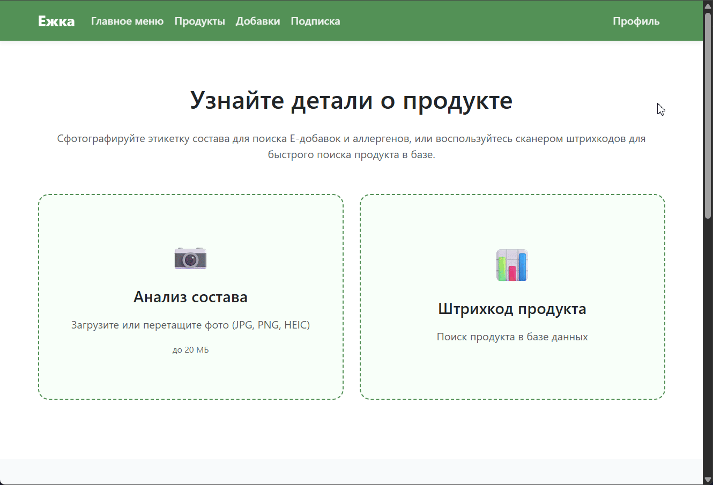
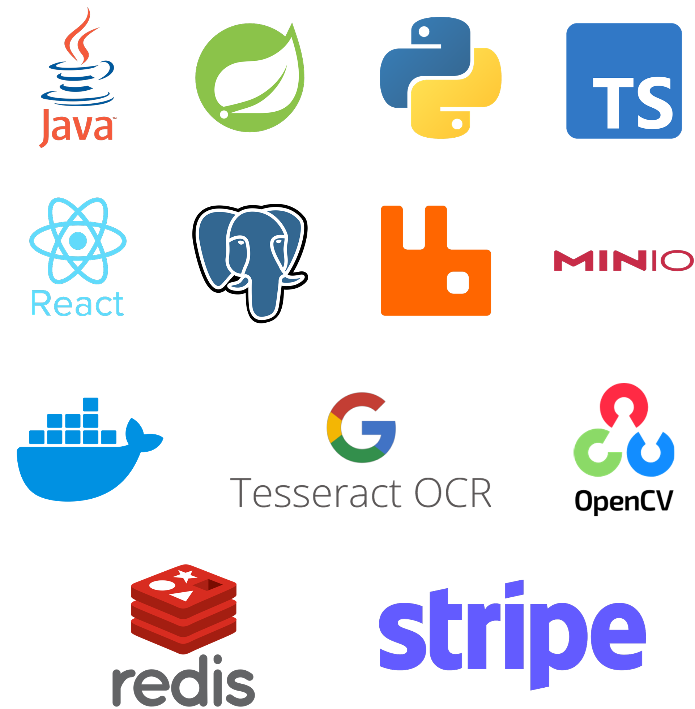
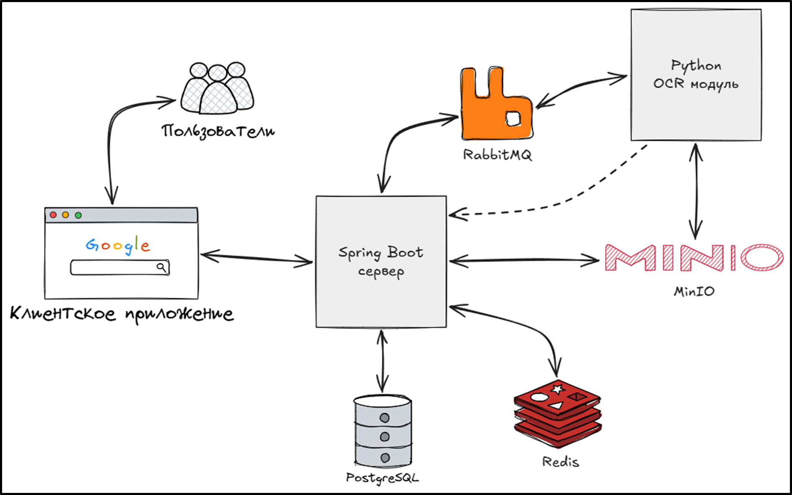
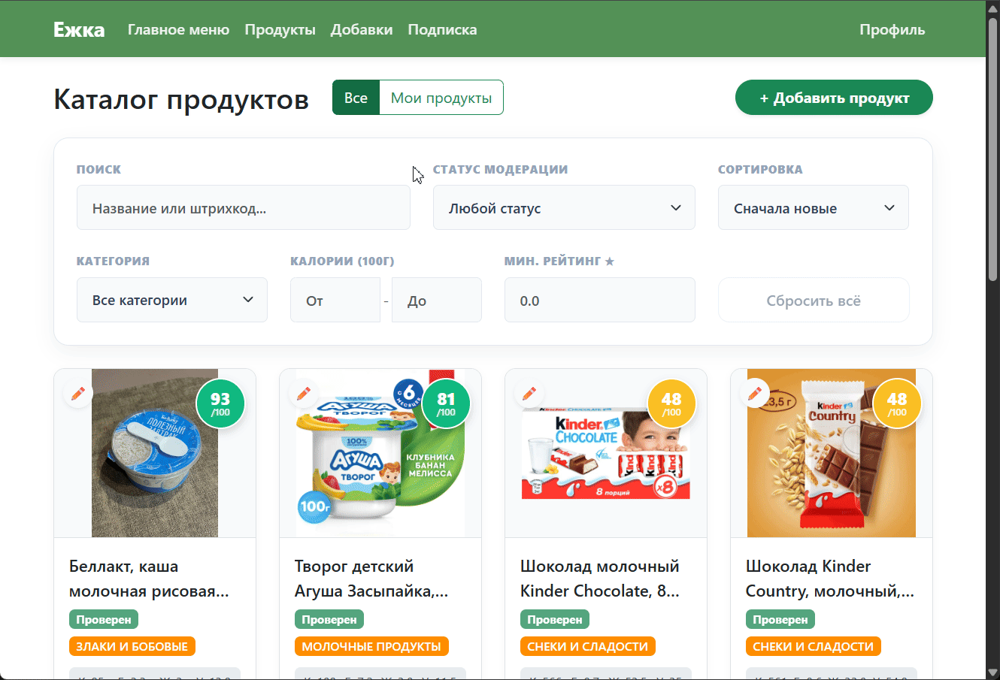
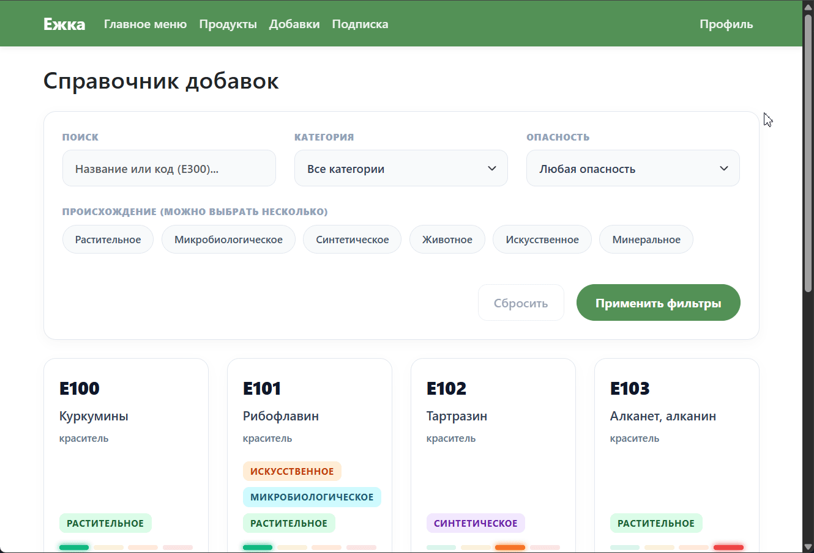
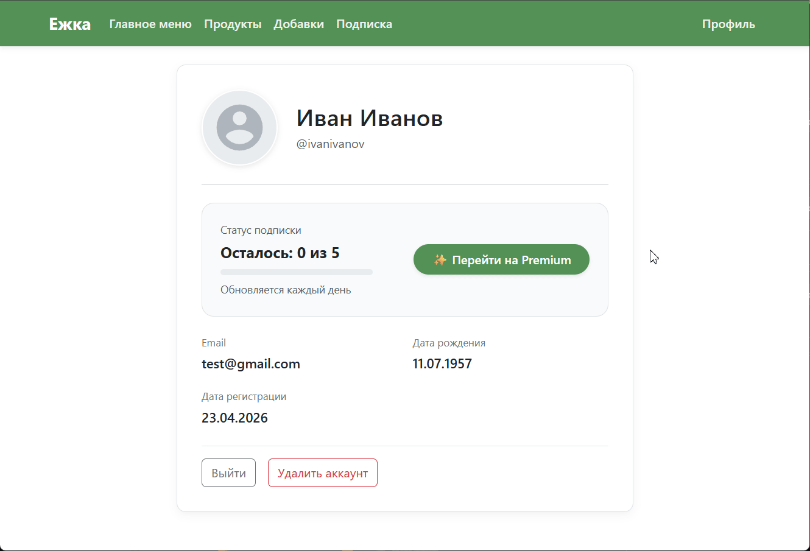

🎓 **Дипломный проект (оценка: 9/10)**

**Ежка** - это полноценное full-stack приложение, которое помогает узнать, что на самом деле скрывается в составе продуктов. Ты просто загружаешь фотку этикетки, а система сама распознает текст, находит Е-добавки, анализирует БЖУ и рассчитывает честный рейтинг безопасности. В основе логики лежат официальные регламенты ЕАЭС, СанПиН и международные стандарты.

  

Проект спроектирован как надежный, готовый к нагрузкам монолит (Production-Ready MVP). Вместо того чтобы раздувать архитектуру микросервисами на раннем этапе, упор сделан на эффективную внутреннюю структуру: асинхронную обработку тяжелых задач через очереди, кэширование и умный нечеткий поиск для очистки данных.

---

## Главные аналоги

Для анализа и вдохновения использовались ведущие мировые платформы в области предоставления информации о продуктах питания:

  
  

* **Open Food Facts:** Глобальная открытая краудсорсинговая база данных. Позволяет пользователям со всего мира сканировать продукты и оценивать их по шкале Nutri-Score и классификации степени обработки Nova. Она стала отличным примером структуры хранения продуктовых метаданных.
* **Yuka:** Популярнейшее мобильное приложение для независимой оценки еды и косметики. Предоставляет простую и понятную 100-балльную шкалу здоровья, раскладывая состав на плюсы (белки, клетчатка) и минусы (сахар, соль, вредные добавки), а также рекомендует более полезные альтернативы.

---

## Стек технологий

* **Бэкенд:** Java 21, Spring Boot 4.0.2, Spring Data JPA (Hibernate), Spring Security (JWT), MapStruct, Lombok, Spring Validation, Stripe Java SDK.
* **Фронтенд:** React, TypeScript, Redux Toolkit.
* **Модуль OCR:** Python, Tesseract OCR, OpenCV, FuzzyWuzzy.
* **Инфраструктура и БД:** PostgreSQL, Redis, RabbitMQ, MinIO, Stripe CLI, Docker.

---

## Архитектура проекта

---

### 📷 Как работает распознавание этикеток (OCR Pipeline)

Чтение состава с реальных банок и пачек - та еще боль. Текст мелкий, этикетки изогнутые, свет плохой. Поэтому вместо того, чтобы просто «натравить» OCR на картинку, я сделал полноценный пайплайн обработки:

1. **Предобработка (OpenCV):** Сырая фотка с телефона обычно дает плохой результат. Сначала OpenCV переводит изображение в оттенки серого, выкручивает контрастность, убирает цифровой шум и делает бинаризацию (оставляет только жесткий черно-белый контраст).
2. **Извлечение текста (Tesseract OCR):** Подготовленная и очищенная картинка скармливается движку Tesseract, который вытаскивает из нее массив «сырого» текста.
3. **Нормализация и нечеткий поиск (FuzzyWuzzy):** Tesseract часто ошибается на сложных шрифтах (например, читает `Е-120` как `E-I2O`, или путает кириллицу с латиницей). Тут вступает в дело FuzzyWuzzy: алгоритм считает расстояние Левенштейна и сопоставляет наш «грязный» текст с эталонным справочником Е-добавок и аллергенов.

  

---

## 🧮 Как работает алгоритм рейтинга?

Я не просто вычитаю баллы за "плохие" ингредиенты, под капотом работает трехэтапная математическая модель:

### 1. Оценка БЖУ (Базовый балл)
Алгоритм учитывает категорию продукта. Белок поощряется, переизбыток сахара и жиров — штрафуется. Каждому параметру присваивается балл $S \in \{25, 50, 75, 100\}$. Взвешенная формула дает базовую оценку:

$$BaseScore = (S_{cal} \cdot 0.40) + (S_{prot} \cdot 0.30) + (S_{fat} \cdot 0.15) + (S_{carb} \cdot 0.15)$$

### 2. Штрафы за Е-шки
Распознанные добавки делятся на `SAFE` (0 штрафа), `WARNING` (аллергены и спорные красители — минус 10 баллов) и `DANGEROUS` (опасные канцерогены — минус 30 баллов). База собрана по ТР ТС 029/2012 и стандартам Codex Alimentarius.

$$Penalty = (N_{danger} \cdot 30) + \min(N_{warning} \cdot 10, 20)$$

### 3. Жесткие лимиты (Safety Limiters)
Самое важное правило бизнес-логики. Если в продукте есть хоть одна добавка `DANGEROUS`, его рейтинг принудительно обрезается до **39 баллов** максимум, даже если у него идеальные БЖУ. А если добавка запрещена законом (`BANNED`), рейтинг моментально падает до **0**.

Итоговый балл калибруется в границах от 0 до 100:

$$FinalScore = \max(0, \min(\text{round}(BaseScore) - Penalty, 100))$$

  

---

## 🔍 Фишки: Поиск, Фильтрация и PostgreSQL

Обычный `LIKE` в базе данных плохо работает с опечатками.
Поэтому для поиска по каталогу я реализовал паттерн **Specification (JPA Criteria API)**, а под капотом задействовал триграммный поиск PostgreSQL:
* Вызывается нативная функция `word_similarity` из расширения `pg_trgm`.
* На лету вырезаются скрытые символы переноса строк.
* Результаты динамически сортируются по коэффициенту релевантности.

Кроме умного поиска, спецификации JPA используются для **многофакторной динамической фильтрации** (по калориям, рейтингу, категориям), что позволяет на лету перестраивать выдачу без перегрузки СУБД.

  
  

---

## 💳 Монетизация (Интеграция Stripe)

Для реализации Premium-доступа к расширенной аналитике интегрирован глобальный платежный шлюз **Stripe**. Обработка успешных платежей, смена статуса пользователя и выдача бейджей реализована асинхронно через Webhooks, что гарантирует защиту от подмены статуса на клиенте.

  

